# User manual

> 📚 [Documentation home](./README.md)

GShare lets many people share a Kubernetes GPU cluster — in **fractional** or **exclusive**
mode — and accounts for usage in credits. This manual walks through the **user console**.
Administrative features are in [`admin-manual.md`](./admin-manual.md).

To get in: open the console URL in a browser and sign in with your email and password.
Everything below — sessions, volumes, and credits — lives in the user console.

> The console ships in English and Korean; switch languages from the top bar. The screenshots
> here are of the fictional company *Nexus AI Lab* (see
> [`screenshots/README.md`](screenshots/README.md)), captured in English.

---

## 1. Signing in

Sign in with your email and password. On first login you are required to change the
password your administrator set.

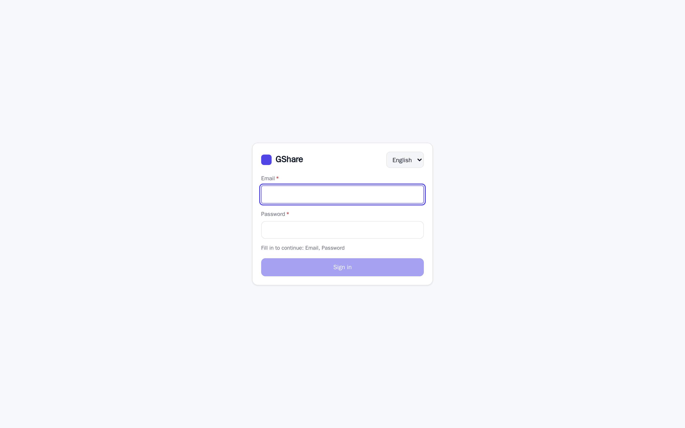

---

## 2. Dashboard

Your credit balance, the number of active sessions, GPU VRAM occupancy, currently running
sessions, and your recent session history, in one view.

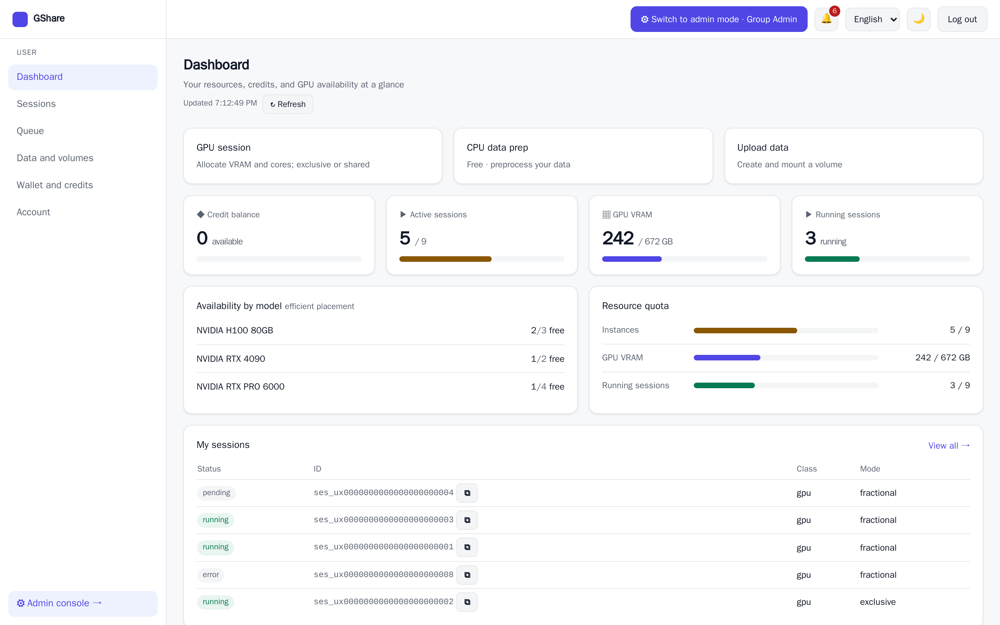

---

## 3. Sessions

A session is your working environment — a pod with a GPU or CPU allocation.

### 3.1 Session list

Only your own sessions are listed, with status, resources, mode, occupancy, uptime, and
cost. The tabs filter by active, running, and terminated; every column sorts, and the search
box narrows by name or id. The filter you set is in the address bar, so the view survives a
reload and can be shared. Select several rows to terminate them in one go.

### 3.2 Creating a session

Pick a compute preset, then a GPU model and tier (fractional or exclusive), then an image —
only CUDA-compatible images are offered. The form shows your resource policy limits and the
**estimated credit cost** as you choose. You can mount volumes at the same time.

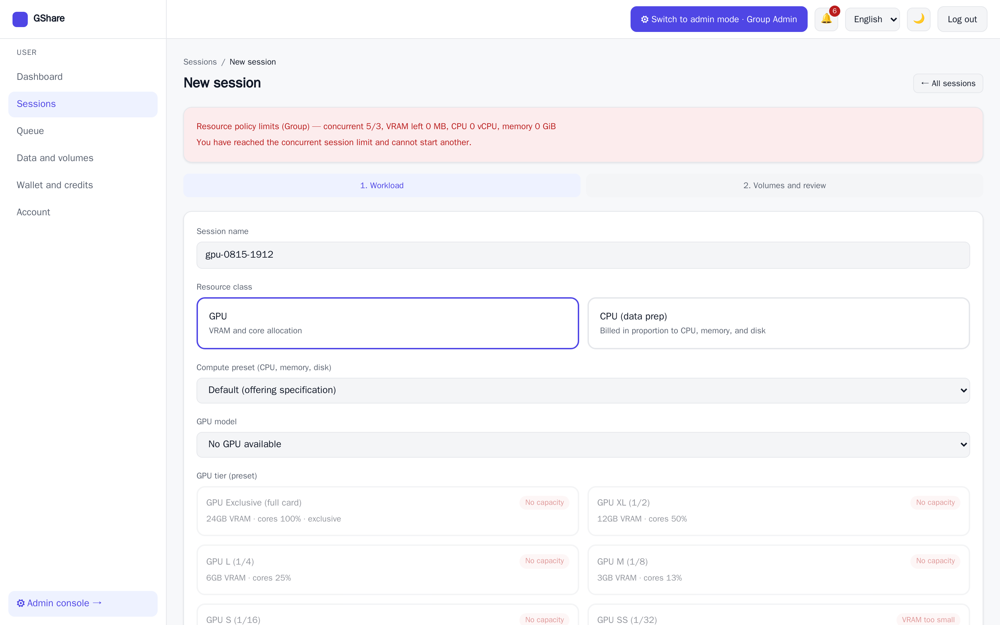

Terminating asks first, naming the session and the credits it has spent.

### 3.3 Session detail — pause, resume, restart

The lifecycle controls are on the session detail page.

- **Pause** tears down the pod, **returns the GPU** so another session can take it
  immediately, and **stops compute billing**. The session, its volumes, and the credit hold
  are preserved. Retained volumes keep billing for their capacity.
- **Resume** **re-acquires a GPU** and picks up where you left off. If no capacity is free,
  the resume waits.
- **Restart** is a stop followed by a resume. **Terminate** settles the bill — refunding
  the unused part of the hold — and releases the resources.

> Idle GPU sessions may be paused automatically by policy so their capacity can be
> reclaimed.

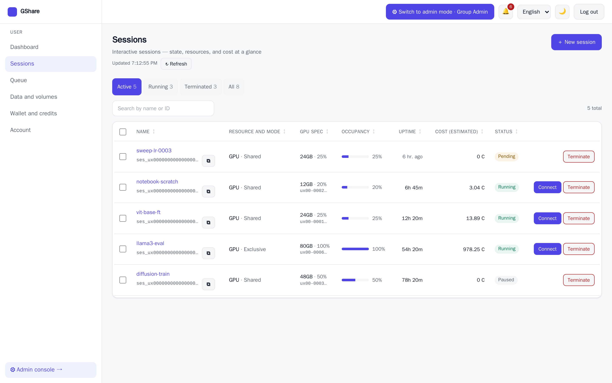

### 3.4 Connecting to a session

A running session is reachable through **VS Code, JupyterLab, or a web terminal** via
single-use links. If a link expires, issue a new one from the same panel.

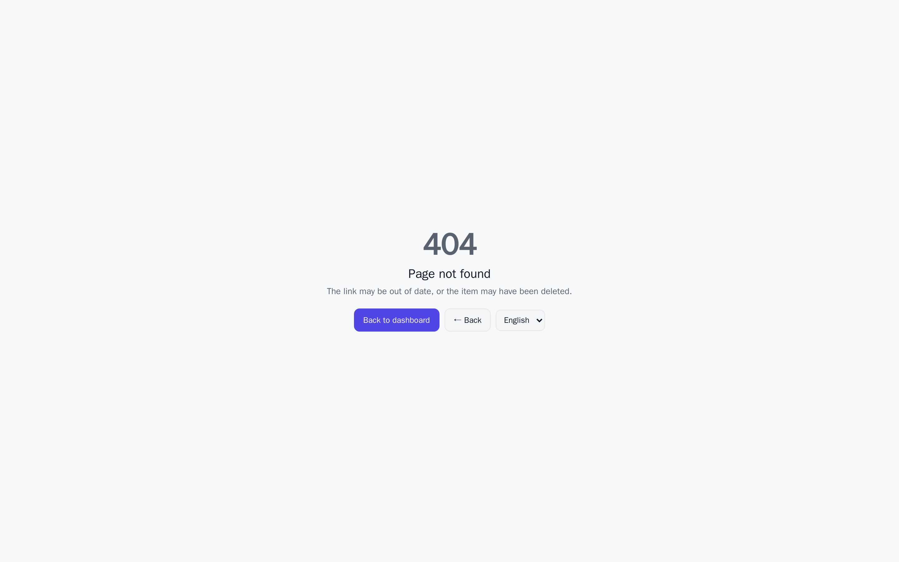

### 3.5 Queue

When the cluster is full, new sessions enter the queue instead of failing. You can see your
priority and waiting time; as capacity is returned, queued sessions are admitted in
priority order.

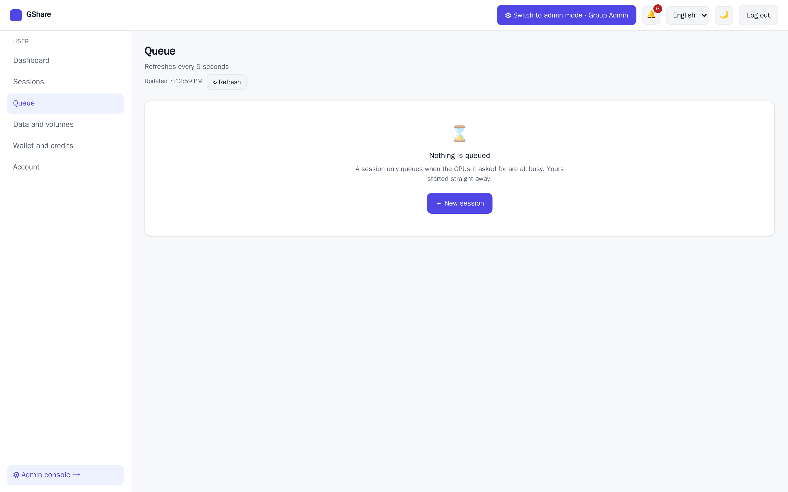

---

## 4. Wallet and credits

### 4.1 Wallet

Your personal wallet's balance, holds, and usage history. Sessions are billed **only from
your personal wallet**.

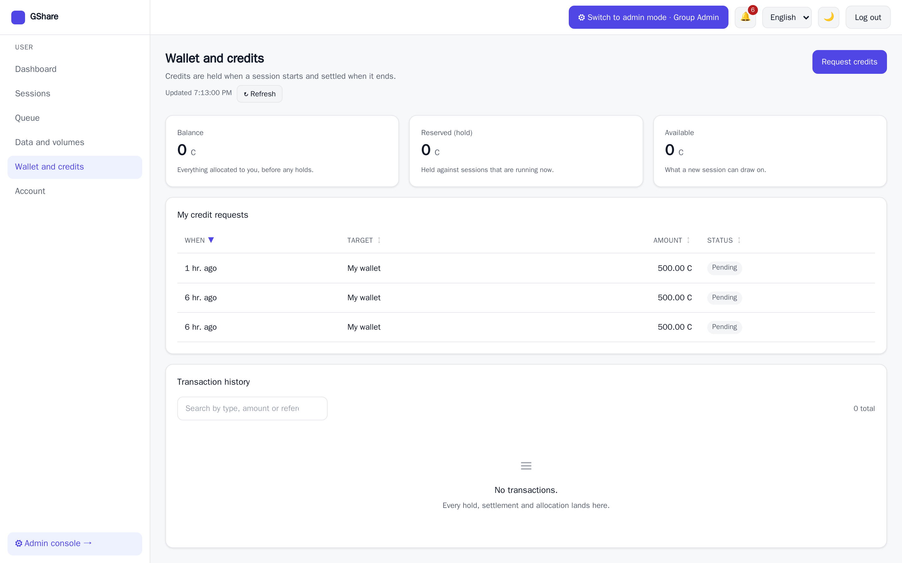

### 4.2 Requesting credits

If your balance is short, request an allocation from your group with an amount and a
reason. A group or organization administrator approves it and the credits land in your
wallet.

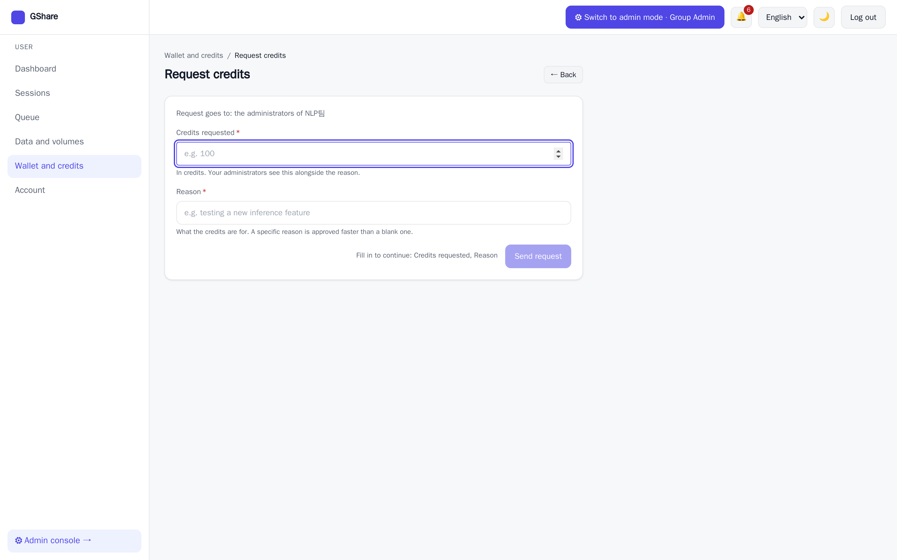

---

## 5. Data and volumes

> A volume bills **continuously, in proportion to its provisioned quota** — per minute from
> the owning wallet (personal or group), whether or not a session is running.

### 5.1 Volume list

Your own volumes, plus shared volumes you have been given access to.

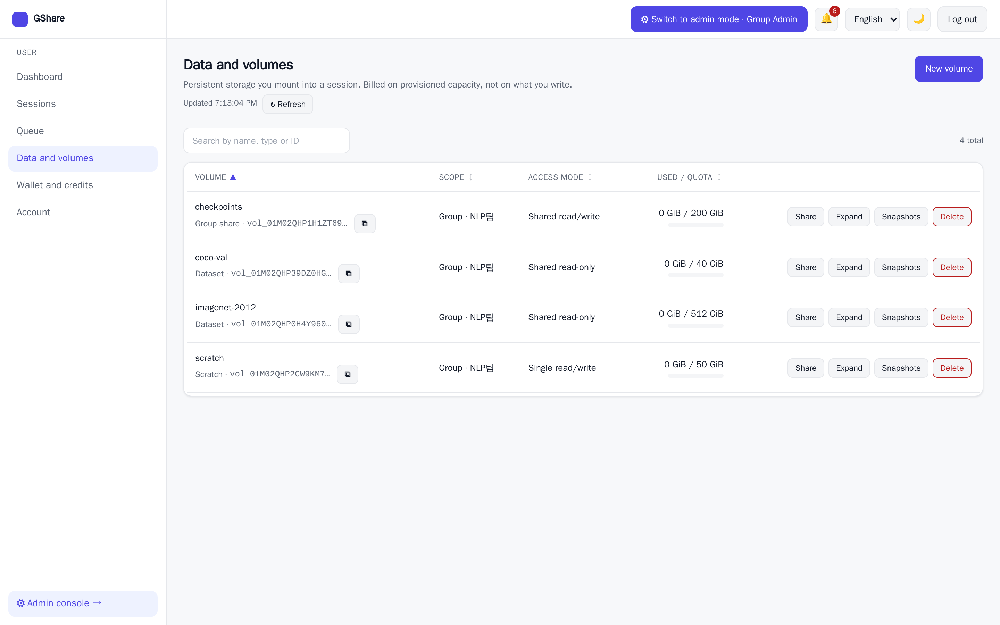

### 5.2 Creating a volume

Choose the owning scope (personal or group), the access mode (read-only or read-write), and
the capacity. The form shows the **estimated credit cost** per hour and per month for that
capacity, and warns when you exceed a policy limit.

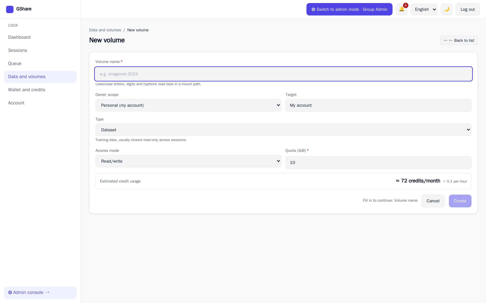

### 5.3 Sharing a volume

Share one of your volumes with another user, read-only or read-write. The recipient can
only mount it in the mode you granted. Removing someone's access takes effect at once and the
confirmation offers **Undo** for a few seconds.

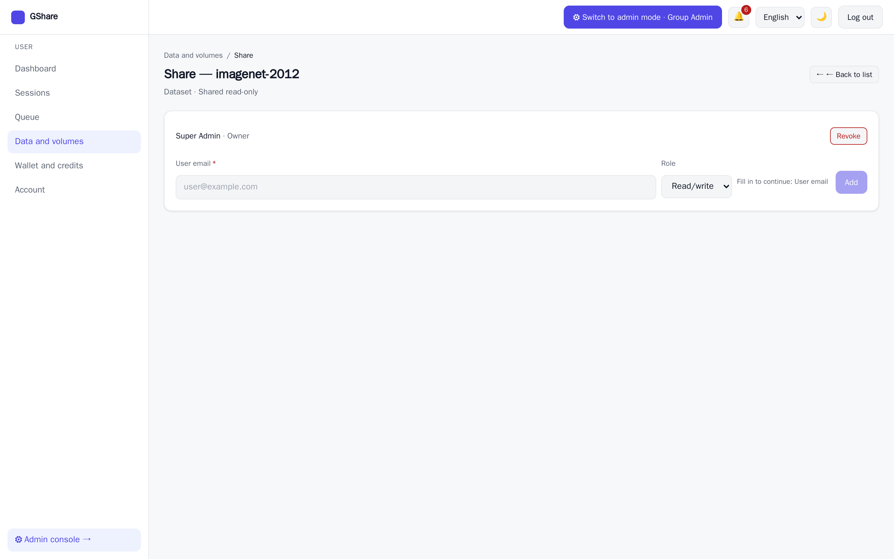

### 5.4 Capacity and expansion requests

Review a volume's capacity against your policy limit and request an expansion.

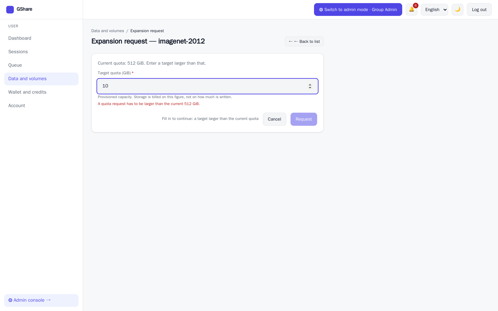

### 5.5 Snapshots

Take point-in-time snapshots and restore from them. Deleting a volume or a snapshot asks for its
name to be typed, because neither can be recovered.

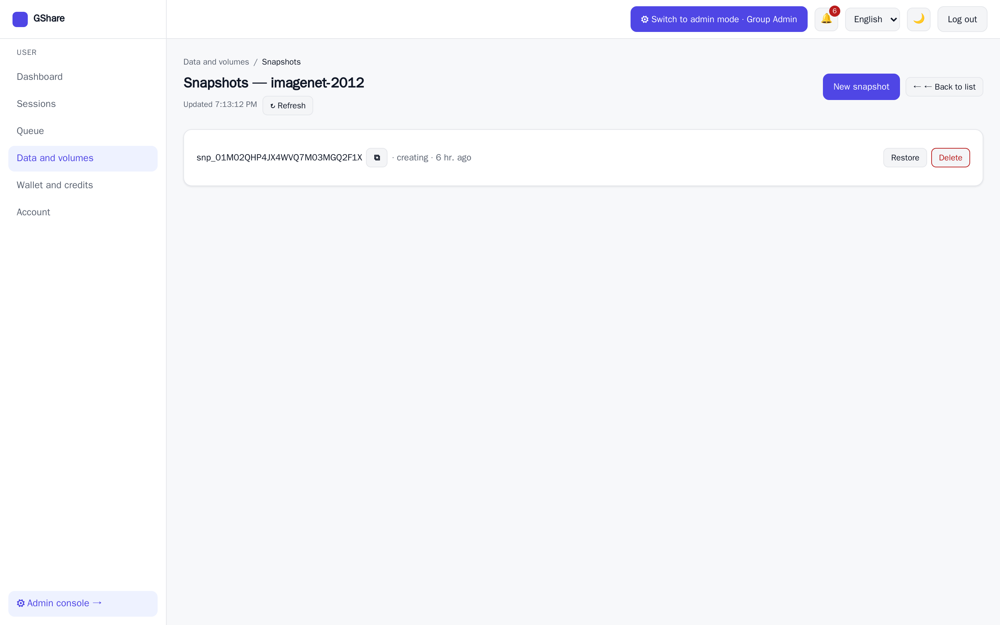

---

## 6. Account

Review your organization and group membership (read-only) along with your role, and edit
your display name.

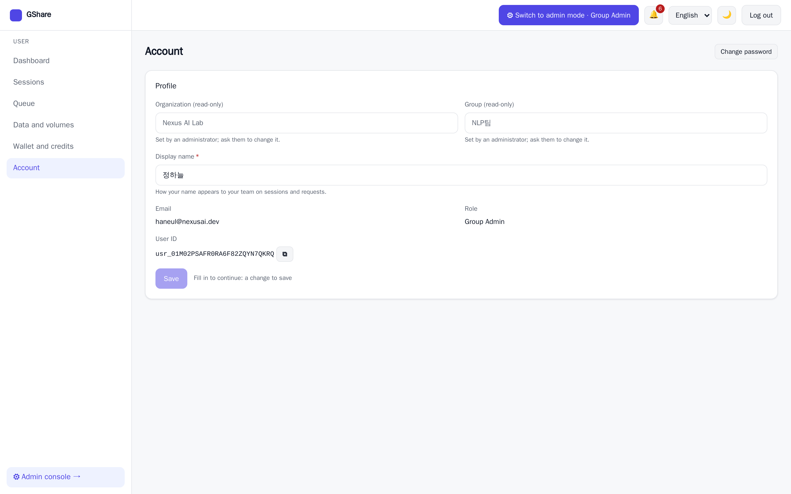

---

Administrative work — organizations, groups, users, resources, policy, budgets, clusters,
and session monitoring — is covered in [`admin-manual.md`](./admin-manual.md).
